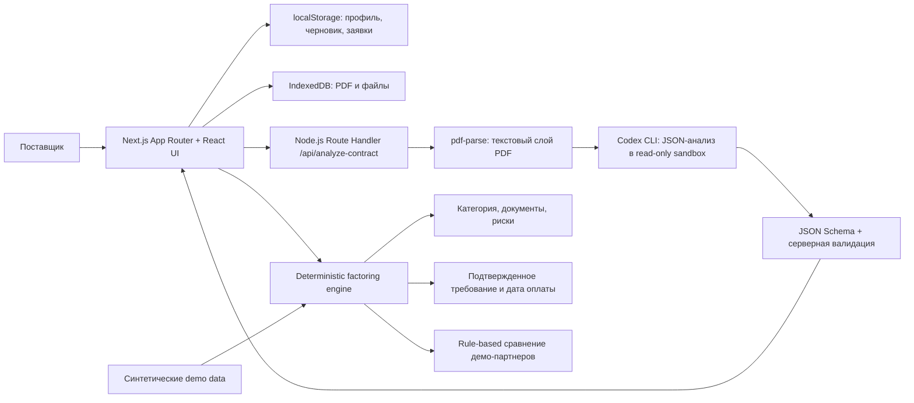

# Tech Vision 2026: командный файл подготовки и защиты FlowFactor

Дата сверки: 21 июля 2026 года
Репозиторий: `yertayyera55-crypto/-TechVision`
Базовый commit перед публикацией документов: `b9ac843` (`origin/main`)
Статус документа: рабочая памятка команды перед онлайн-сдачей и возможным финалом

Этот файл собран по двум переданным PDF и по текущему коду репозитория. Он отвечает на вопросы «что сдаём», «что именно работает», «как это объяснять» и «что нельзя обещать жюри». Поля, которых нет в репозитории, помечены как `НУЖНО ЗАПОЛНИТЬ КОМАНДЕ`.

## 1. Что нужно запомнить

### Рабочая тема проекта

- Направление: **Digital Economy & Future Tech**.
- Проблемная зона: **Local Commerce**.
- Один пользователь: **малый локальный поставщик продуктов, уже поставляющий товар торговой сети**.
- Одна острая боль: **после поставки деньги заморожены на 60-90 дней, поэтому поставщику не хватает оборотного капитала для следующего цикла и роста**.
- Решение: **FlowFactor превращает договор поставки в проверенную предварительную заявку на факторинг и показывает прозрачное сравнение демо-вариантов**.
- Короткий USP: **один PDF-договор -> паспорт сделки -> подтвержденное требование -> универсальная заявка -> объяснимое сравнение вариантов**.

Это основная формулировка для Pitch Deck, TVEP и защиты. Анализ договора, документы и подбор партнера - способы снять одну боль с оборотным капиталом, а не отдельные проблемы.

### Формулировка на 20 секунд

> Локальный поставщик уже умеет производить и продавать товар, но после поставки торговой сети ждет оплату 60-90 дней. FlowFactor читает договор, выделяет подтвержденное денежное требование, готовит заявку и объясняет предварительные варианты финансирования. В MVP финансовые партнеры и оферты синтетические: мы демонстрируем рабочий цифровой путь, а не выдачу денег.

### Главный риск позиционирования

Текущий проект технически похож на FinTech, потому что работает с факторингом. На хакатоне его нужно защищать как **Local Commerce**: барьер локального поставщика находится в цепочке «сделал -> поставил -> дождался оплаты -> продолжил рост». Не называйте FlowFactor банком, МФО, факторинговой компанией или системой одобрения кредита. Если команда официально зарегистрирована в другой зоне, в этой памятке нужно заменить только трек/зону и соответствующую аргументацию, но не придумывать новую регистрацию.

## 2. Что требует хакатон

### Команда и участие

- Допускаются учащиеся 8-12 классов и студенты 1-2 курсов колледжей Республики Казахстан.
- В команде строго 2-4 человека.
- Один участник может состоять только в одной команде.
- Замена участника возможна не позднее чем за 24 часа до дедлайна онлайн-этапа и требует согласования с оргкомитетом.
- Финал гибридный: очно в Назарбаев Университете в Астане или дистанционно для утвержденных региональных команд.
- Для очной защиты физически присутствовать должен минимум один участник; желательно присутствие всей команды.
- Рабочий язык можно выбрать: русский, казахский или английский.

### Деньги и логистика

- Организационный сбор: 4 000 тенге с команды.
- После прохождения первичного технического фильтра сбор невозвратный.
- Проезд, проживание и личные расходы очных участников оргкомитет не компенсирует.
- По запросу оргкомитет может выдать именное письмо для учебного заведения.

### Даты и дедлайны

| Дата | Этап | Что делать команде |
|---|---|---|
| 17 июля 2026 | Старт | Разработка и публикация проблемных зон |
| 21 июля 2026, 23:59 | Онлайн-сдача | Загрузить форму, Pitch Deck, публичный репозиторий и видео либо live-ссылку |
| 22-23 июля 2026 | Онлайн-отбор | Экспертная оценка и технический фильтр |
| До 24 июля 2026 | Финалисты | Проверить список и готовить очную защиту |
| До 26 июля 2026 | TVEP | Финалисты отправляют TVEP за 24 часа до финала |
| 27 июля 2026 | Финал | 4 минуты на pitch + живую демонстрацию и 2 минуты на Q&A |

В PDF указан дедлайн 21 июля в 23:59, но часовой пояс отдельно не указан. Сдавать нужно заранее, не рассчитывая на последнюю минуту.

### Обязательный пакет онлайн-этапа

1. **Pitch Deck** в PDF, максимум 12 слайдов: проблема, решение, целевая аудитория, технологический стек, бизнес-модель, команда.
2. **Публичный GitHub/GitLab-репозиторий** с исходным кодом, созданным в дни хакатона, и README.md со стеком, архитектурой и локальным запуском.
3. **Доказательство работы MVP**, один вариант:
   - видео-демо до 3 минут с открытым доступом на YouTube/Google Drive;
   - рабочая live-ссылка на сайт/веб-приложение/бот или рабочий APK.

Только Figma, только слайды или только описание идеи автоматически отсеиваются. Нужен функционирующий код и пользовательский сценарий.

### TVEP только для финалистов

TVEP (Tech Vision Engineering Portfolio) - PDF **ровно на 3 страницы**:

1. Название, трек, одна боль одного пользователя, USP.
2. Архитектурная схема, фронтенд, бэкенд, базы данных, внешние API, стек и логика AI-компонентов.
3. Математическая/алгоритмическая модель, Cost Structure и Revenue Streams для коммерческого проекта.

TVEP отправляется за 24 часа до финала. На финале жюри ждет Show, Don't Slide: основной акцент на живой работе MVP.

## 3. Как жюри оценивает проект

### Онлайн-этап: максимум 30 баллов

| Критерий | Что жюри ищет | Чем FlowFactor доказывает | Что обязательно усилить |
|---|---|---|---|
| Исследовательская глубина, актуальность и новизна | Реальная боль в Казахстане, глубина CustDev, связь технологии с конкретной болью | Локальный поставщик, торговая сеть, отсрочка оплаты, понятный пользовательский путь | Добавить 2-3 реальных интервью или честно обозначить синтетические данные |
| Инженерное проектирование и архитектура | Чистый модульный код, логичная схема данных, настоящая AI-интеграция или надежные алгоритмы | Next.js-модули, строгая JSON Schema, Codex CLI в read-only sandbox, отдельный rule engine | Каждый разработчик должен объяснить свою часть кода и алгоритм |
| Техническая валидация и итеративность | Рабочий прототип и история коммитов на протяжении хакатона | Git-история с 17 по 21 июля, рабочий end-to-end flow и smoke-тесты | Сохранить публичную историю; записать демонстрацию без сломанных шагов |

Онлайн-баллы - только квалификационный фильтр. Если команда попадает в финал, эти баллы обнуляются.

### Финал: максимум 40 баллов

| Критерий | Что нужно показать |
|---|---|
| Стабильность демо, UI/UX и уникальность | Пользователь за несколько минут проходит полный путь без ручной подготовки заявки с нуля |
| Техническая защищенность, системная архитектура и TVEP | Почему выбран именно этот стек, где AI, где правила, как защищены файлы, как считается результат |
| Монетизация, устойчивость и масштабируемость | Кто платит, из чего состоят затраты, как заменить синтетических партнеров реальными интеграциями |
| Командная доставка и Q&A | Все разработчики участвуют и уверенно объясняют код, ограничения и решения |

## 4. Что уже есть в репозитории

### Доказанное состояние

- Репозиторий публичный: `https://github.com/yertayyera55-crypto/-TechVision`.
- Default branch: `main`; базовый HEAD перед публикацией документов `b9ac843` совпадал с `origin/main`.
- Рабочее дерево перед добавлением этого файла было чистым.
- История разработки начинается 17 июля и содержит последовательные изменения до 21 июля: базовый MVP, мониторинг оплат, AI-анализ договора, анкета, категорийный flow, демо-договор и сравнение предложений.
- README уже описывает границы MVP, локальный запуск, AI-поток, реальные и симулированные части.
- Главный пользовательский сценарий работает: профиль -> договор -> AI-анализ -> категория -> требование -> анкета -> сравнение предложений.
- TypeScript проверен командой `npm run typecheck`.
- ESLint проверен командой `npm run lint`.
- Production build успешно проходит в Webpack-режиме: `npm run build -- --webpack`.

### Что пока не доказано в репозитории

| Артефакт или факт | Статус | Что нужно сделать |
|---|---|---|
| Pitch Deck | Не найден в текущем репозитории | Подготовить PDF до 12 слайдов |
| Видео до 3 минут или live-ссылка | Не найдено в текущем репозитории | Записать видео и проверить доступ по ссылке; live использовать только как дополнительный вариант |
| TVEP | Не найден | Готовить только при выходе в финал, ровно 3 страницы |
| CustDev | Не найден в коде/README | Провести 2-3 коротких интервью либо явно написать, что данные синтетические |
| Состав команды, роли, возраст и регистрация | Не подтверждены кодом | Заполнить официальную форму без расхождений с Pitch Deck |
| Подтверждение оплаты 4 000 тенге | Не подтверждено кодом | Сохранить чек/подтверждение у капитана |
| Родительские согласия | Нужны только финалистам при наличии несовершеннолетних | Получить шаблон оргкомитета и собрать оригиналы/сканы по формату финала |
| Финальный формат и логистика | Не подтверждены кодом | После списка финалистов выбрать очный/дистанционный формат и подготовить технику |

## 5. Технологический стек - как говорить точно

| Слой | Фактическая реализация |
|---|---|
| Язык | TypeScript 5.8, strict mode |
| UI | React 19, Next.js 16.2.10 App Router, клиентские React-компоненты |
| Стили | Tailwind CSS 3.4.17, PostCSS 8.5.19, адаптивная верстка |
| Иконки | `lucide-react` |
| Серверная часть | Next.js Route Handler `app/api/analyze-contract/route.ts`, Node.js runtime |
| Работа с PDF | `pdf-parse` для извлечения текстового слоя |
| AI | Локальный авторизованный Codex CLI: `codex exec`; прямой OpenAI API в MVP не используется |
| Формат AI-ответа | JSON Schema + серверная валидация полей, enum категорий и числовых диапазонов |
| Хранение метаданных | `localStorage` через React Context и локальные repository-абстракции |
| Хранение файлов | IndexedDB в браузере; бинарные PDF/изображения не кладутся в localStorage |
| База данных | В активном демо-потоке нет удаленной БД. Supabase-клиент и repository-контракт подготовлены как следующий слой, но без env-переменных приложение работает локально |
| Доменные правила | TypeScript-модули `lib/factoring-engine.ts`, `data/product-categories.ts`, `data/demo-partners.ts` |
| Тесты | TypeScript, ESLint и Web/Playwright smoke-сценарии в `tests/`; Python dependency - `playwright` |
| Запуск | Node.js 20.16+ или 22.3+, `npm run demo` или `npm run dev` |
| Деплой | Подготовленный демо-сценарий рассчитан на Vercel; настоящий пользовательский PDF-анализ требует локального авторизованного Codex CLI |

### Архитектура



### Где AI, а где обычный код

**AI выполняет только извлечение и предварительную классификацию:** стороны, номер договора, сумма, даты, срок оплаты, предмет поставки, категория, условия приемки/возврата/удержаний/уступки, документы и короткие evidence-фрагменты.

**Обычный детерминированный код выполняет:** обязательные поля, матрицу документов и рисков, расчет денежного требования, дату оплаты, готовность заявки, ranking и объяснение демо-предложений.

Итоговая позиция для жюри: **LLM не принимает решение о финансировании и не назначает банковскую ставку.** Он помогает прочитать договор; результат проходит проверку, а финансовая логика вынесена в обычные функции.

## 6. Что именно работает в MVP

1. Пользователь создает локальный демо-кабинет или продолжает с готовым профилем.
2. Загружает PDF-договор до 10 МБ или запускает готовый демо-договор.
3. Файл проверяется по расширению, MIME и PDF-сигнатуре.
4. PDF сохраняется в IndexedDB и остается доступным после перезагрузки страницы.
5. Текстовый слой извлекается локально; сканированный PDF без текстового слоя получает понятную ошибку.
6. Локальный Codex CLI возвращает строго структурированный анализ.
7. Пользователь видит найденные поля и короткие фрагменты-основания, может поправить категорию.
8. Система учитывает принятые поставки, возвраты и удержания.
9. Формируется универсальная анкета с источником каждого поля: профиль, договор, документ поставки, система или «нужно заполнить».
10. Система сравнивает 2-3 синтетических предложения и объясняет рейтинг.
11. Пользователь может выбрать любой вариант; рекомендация не блокирует выбор.
12. Есть read-only раздел мониторинга сроков оплаты для демонстрационной сделки.

### Стабильный демо-сценарий

- Поставщик: ТОО «Arman Tea».
- Покупатель: ТОО «Aspan Market».
- Товар: фасованный чай.
- Сумма: 10 000 000 ₸.
- Отсрочка: 60 дней.
- Дата поставки: 25 сентября 2026.
- Ожидаемая дата оплаты: 24 ноября 2026.
- Демо-договор содержит приемку по подписанной накладной, правила возврата, удержаний и уступки требования.
- Для подготовленного демо-анализа дополнительные документы необязательны на первом шаге.

На сцене нужно использовать именно этот сценарий: он детерминирован, объясним и не зависит от внешнего AI API. Настоящий пользовательский PDF можно показать отдельно, только если на машине настроен авторизованный Codex CLI.

## 7. Математика и алгоритмы

### Подтвержденное требование

```text
confirmedReceivable = max(0, acceptedSupplyAmount - returnsAmount - holdsAmount)
demoUpperLimit = round(confirmedReceivable * 0.95)
availableFinancing = min(demoUpperLimit, desiredFinancingAmount || demoUpperLimit)
dueDate = confirmationDate + max(0, paymentTermDays)
```

Важно: 95% - демонстрационный верхний предел, а не обещание реального финансового партнера.

### Демо-предложение партнера

```text
financingAmount = min(availableFinancing,
                      confirmedReceivable * partner.financingPercentage / 100)
cost = round(financingAmount * partner.commissionRate
             * max(1, termDays) / 60)
netAmount = max(0, financingAmount - cost)
```

У каждого синтетического партнера есть maxTermDays, minReceivable, процент финансирования, комиссия, тип факторинга, требования к приемке, отношение к скоропортящимся товарам и приоритетные категории. Итоговый score учитывает приоритетную категорию, процент финансирования, количество caveats и комиссию. Рейтинг объясняется пользователю, но выбор остается за ним.

### Готовность заявки

Система проверяет наличие договора, условий приемки и условий уступки, затем учитывает обязательные документы категории и риски. Это preliminary readiness, а не юридическое заключение и не решение о выдаче финансирования.

## 8. AI-комплаенс, безопасность и ограничения

### Что можно честно заявить

- AI-инструменты на хакатоне разрешены, но каждый участник обязан понимать код.
- В договоре есть недоверенные данные: prompt запрещает выполнять инструкции из документа и использует его только как источник фактов.
- Codex запускается через `child_process.spawn` без shell.
- Пользовательский текст передается через stdin, а не через аргументы командной строки.
- Используются `--ephemeral`, `--sandbox read-only`, отдельная временная папка и удаление папки в `finally`.
- Вход ограничен PDF, MIME-типом, сигнатурой и размером до 10 МБ; анализ ограничен четырьмя файлами и длиной извлеченного текста.
- Ответ проходит JSON Schema и дополнительную серверную валидацию.
- Текст договора, реквизиты и AI-результат не пишутся в обычные логи.
- Есть таймаут анализа и понятные ошибки для недоступного Codex, плохого результата и PDF без текстового слоя.

### Ограничения, о которых нужно сказать самим

- OCR для сканированных PDF не реализован.
- В Vercel Codex CLI обычно недоступен, поэтому live-демо использует прозрачный подготовленный сценарий.
- В MVP нет реальной передачи заявки, одобрения, выплаты, подписания, банковского статуса или подтверждения оплаты.
- Демо-партнеры, комиссии, критерии и оферты синтетические.
- Метаданные и файлы хранятся локально в браузере; это не production-grade multi-user storage.
- Реальные документы, БИН, банковские реквизиты и персональные данные нельзя использовать в публичной видеозаписи без согласия.

### Пример ответа на вопрос «Почему это не просто обертка над API?»

> В AI-части есть фиксированная задача извлечения, строгая схема данных, ограничения на недоверенный документ, evidence-фрагменты и серверная валидация. Но решение не доверяет LLM финансовую логику: категорийная матрица, расчет требования, готовность и подбор партнеров реализованы отдельно и детерминированно. Поэтому AI - один этап конвейера, а не единственная бизнес-логика.

## 9. Что реально, а что симулировано

| Реально работает | Симулировано или отложено |
|---|---|
| Загрузка и локальное хранение PDF | Реальные банки и факторинговые компании |
| Извлечение текста и локальный Codex-анализ | Передача заявки внешнему партнеру |
| Категория, evidence, missing data | Реальный скоринг и решение об одобрении |
| Расчет требования и даты оплаты | Реальные комиссии, оферты и выплата |
| Автозаполнение анкеты | Подписание договора и банковские статусы |
| Rule-based matching с объяснением | Подтверждение фактической оплаты покупателем |
| Сравнение предложений и выбор любого варианта | Продакшен-хранилище, мультипользовательская авторизация и SLA |

Фраза для защиты: **«Мы показываем работающий прототип подготовки заявки и объяснимого сравнения, а не притворяемся финансовой организацией».**

## 10. Бизнес-модель и масштабирование

Проект коммерческий, поэтому в TVEP и Pitch Deck нужно показать гипотезу, а не выдавать ее за уже подтвержденную выручку.

### Cost Structure

- хостинг веб-приложения;
- inference/LLM и обработка PDF в production-версии;
- защищенное файловое хранилище и резервное копирование;
- безопасность, аудит, юридическая проверка и работа с согласием пользователя;
- интеграции с реальными финансовыми партнерами и торговыми сетями;
- поддержка поставщиков и сопровождение пилотов.

### Revenue Streams

Основная гипотеза: B2B/B2B2B-модель для финансовых партнеров - плата за квалифицированную, согласованную и подготовленную заявку либо подписка за workflow и аналитику. Для поставщика можно оставить бесплатный базовый вход или платный расширенный тариф после проверки ценности. В MVP платежей нет, это гипотеза для валидации.

### Как масштабировать

1. Заменить локальные repository-реализации на Supabase/Postgres и защищенное object storage.
2. Добавить настоящую авторизацию, tenant isolation, audit log и управление согласиями.
3. Перенести AI на защищенный серверный LLM API, добавить OCR и контроль качества извлечения.
4. Подключить реальные анкеты и API финансовых партнеров.
5. Добавить статусы заявки, электронное подписание, уведомления и мониторинг оплат.
6. Сохранить rule engine и объяснимые расчеты как отдельный проверяемый слой.

### Будущие метрики

- время от загрузки договора до готовой заявки;
- доля полей, заполненных без ручного ввода;
- accuracy извлечения на размеченной выборке договоров;
- доля заявок без критически недостающих данных;
- время до первого подходящего предложения;
- конверсия пилотных поставщиков в повторное использование;
- сумма оборотного капитала, которую поставщик сможет высвободить после интеграции с реальными партнерами.

## 11. Готовый сценарий 4-минутной защиты

| Время | Что показать и сказать |
|---|---|
| 0:00-0:25 | Один поставщик, одна боль: товар уже отгружен, деньги будут через 60-90 дней |
| 0:25-0:45 | FlowFactor: один договор превращается в проверенную заявку |
| 0:45-1:25 | Открыть демо-профиль и запустить готовый договор Arman Tea -> Aspan Market |
| 1:25-1:55 | Показать найденные условия, категорию «Чай и кофе» и evidence-фрагменты |
| 1:55-2:25 | Показать расчет подтвержденного требования, возвратов, удержаний и даты оплаты |
| 2:25-3:00 | Показать анкету с источником каждого поля и возможностью исправления |
| 3:00-3:30 | Показать 2-3 синтетических варианта, score, caveats и свободный выбор партнера |
| 3:30-3:50 | Объяснить AI/правила, локальное хранение и границу: это не выдача денег |
| 3:50-4:00 | USP, коммерческая гипотеза и финальная фраза |

Финальная фраза:

> FlowFactor сокращает путь локального поставщика от уже выполненной поставки до готового и объяснимого запроса на финансирование, сохраняя контроль человека над каждым важным полем.

### План Б сцены

- Всегда иметь резервную запись полного сценария до 3 минут.
- Хранить локальную копию видео и проверенную публичную ссылку.
- Перед защитой открыть вкладку с приложением, вкладку с видео и README.
- Для очной защиты иметь заранее подготовленный браузерный профиль и демо-данные.
- Не зависеть от live AI API: основной сценарий должен быть подготовленным и детерминированным.

## 12. Вероятные вопросы жюри и короткие ответы

| Вопрос | Ответ, который соответствует текущему коду |
|---|---|
| Почему Local Commerce? | Мы решаем барьер локального поставщика между поставкой в торговую сеть и следующим циклом продаж: деньги заморожены в отсрочке. Финансовая логика - способ убрать барьер доступа к цифровому рынку, а не отдельный банковский продукт. |
| Кто один пользователь? | Малый локальный поставщик продуктов. Покупатель и финансовый партнер - участники его процесса, но не вторые целевые аудитории MVP. |
| В чем одна боль? | Не «сложные документы вообще», а нехватка оборотного капитала из-за 60-90-дневной отсрочки после поставки. Документный flow только сокращает путь к решению. |
| Как проверили боль? | Назвать реальные интервью, если они проведены. Если нет - честно сказать, что текущие данные синтетические и это следующая обязательная валидация; не придумывать цитаты. |
| Что именно делает AI? | Извлекает факты из PDF и предварительно классифицирует товар. Поля могут быть null, есть evidence и missingData. Финансовое решение AI не принимает. |
| Где ваши алгоритмы? | В `lib/factoring-engine.ts`: подтвержденное требование, дата оплаты, readiness и rule-based matching. Формулы приведены в TVEP. |
| Откуда взялись 95%, комиссии и партнеры? | Это синтетические демо-критерии для прозрачного сценария. Мы не выдаем их за реальные ставки или оферты. |
| Почему не используете реальную базу? | MVP фокусируется на проверяемом пользовательском пути и приватной локальной демонстрации. Архитектурный контракт repository позволяет заменить localStorage на Supabase/Postgres без переписывания UI. |
| А данные пользователя защищены? | В MVP документы и метаданные хранятся локально в браузере, AI запускается в read-only ephemeral sandbox, а текст договора не логируется. Для production добавим авторизацию, object storage, encryption, tenant isolation и audit log. |
| Почему Codex CLI, а не OpenAI API? | Это проверяемый локальный хакатонный сценарий без хранения API-ключа в приложении. Для production заменим provider на защищенный серверный LLM API. |
| Что будет со сканированным PDF? | В текущем MVP OCR нет; пользователь получает понятную ошибку и должен загрузить PDF с текстовым слоем. OCR - явно обозначенный следующий шаг. |
| Как вы предотвращаете hallucination? | Prompt запрещает придумывать данные, возвращает null при отсутствии факта, требует evidence, затем JSON Schema и серверная валидация; критические расчеты идут не через LLM. |
| Вы реально переводите деньги? | Нет. FlowFactor не банк и не факторинговая компания, не переводит деньги и не принимает окончательное решение. В демо партнеры, заявки и оферты синтетические. |
| Что масштабируется первым? | Безопасное серверное хранение, авторизация и согласия, OCR, реальные критерии и API партнеров, audit log и статусы заявки. |
| Кто платит? | Рабочая гипотеза - финансовый партнер платит за квалифицированную согласованную заявку или подписку на workflow; в MVP эта гипотеза не монетизируется и должна быть проверена пилотом. |
| Как доказать, что код написан на хакатоне? | Показать публичный Git log: первые изменения с 17 июля и последовательные commits до 21 июля. Не переписывать историю и сохранить доступ к репозиторию. |
| Что будет, если на сцене не будет интернета? | У нас есть резервное видео до 3 минут и подготовленный демо-сценарий; регламент прямо требует продолжить защиту через скринкаст при техническом сбое. |
| Почему жюри должно верить вашей команде? | Каждый участник отвечает за конкретный слой и может объяснить путь данных, код, ограничения и формулы. Нельзя делегировать технические ответы одному спикеру. |

## 13. Чек-лист перед отправкой

### Сегодня, до онлайн-дедлайна

- [ ] В официальной форме совпадают состав 2-4 человека, возраст, контакты, трек Local Commerce и формат участия.
- [ ] Подтвержден организационный сбор 4 000 тенге.
- [ ] Pitch Deck не превышает 12 слайдов и начинается с одного пользователя и одной боли.
- [ ] В Pitch Deck есть: проблема, CustDev, решение, UX-flow, стек, архитектура, AI vs rules, ограничения, бизнес-модель, команда.
- [ ] Репозиторий публичный, default branch понятен, README запускается по инструкции.
- [ ] В README и защите явно разделены реальные и синтетические части.
- [ ] Проверены команды `npm run typecheck`, `npm run lint`, `npm run build -- --webpack`.
- [ ] Записано видео до 3 минут или проверена live-ссылка; лучше иметь оба варианта.
- [ ] Ссылки открываются без авторизации и не требуют прав владельца.
- [ ] Демонстрация использует подготовленный сценарий Arman Tea -> Aspan Market.
- [ ] В видео нет реальных персональных данных, БИН, банковских реквизитов и приватных документов.
- [ ] Ссылка на репозиторий и ссылка на демо вставлены в форму, а не только в README.

### Если пройдем в финал

- [ ] TVEP ровно 3 страницы PDF.
- [ ] TVEP совпадает с фактическим кодом: Next.js/React/TypeScript, Route Handler, PDFParse, Codex CLI, localStorage/IndexedDB, rule engine.
- [ ] На странице 1 ровно одна боль и один пользователь.
- [ ] На странице 2 есть архитектурная схема и AI-логика.
- [ ] На странице 3 есть формулы, Cost Structure и Revenue Streams.
- [ ] TVEP отправлен не позднее чем за 24 часа до финала.
- [ ] Подготовлены 4 минуты живой демонстрации и 2 минуты Q&A.
- [ ] У каждого разработчика есть свой технический блок и 3-5 вопросов для тренировки.
- [ ] Согласия родителей собраны по инструкции оргкомитета, если это требуется.
- [ ] Есть резервное видео, копия проекта и подготовленный ноутбук/браузер.

## 14. Источники сверки

- `Digital Economy & Future Tech.pdf`, 12 страниц: философия проблемных зон, Local Commerce, дедлайны, Pitch Deck/репозиторий/демо, TVEP, критерии, AI-комплаенс и дисквалификация.
- `TechVision Положение.pdf`, 12 страниц: официальный регламент, состав команд, взнос и логистика, даты, треки, формат сдачи, TVEP, оценивание, согласия, IP и план Б.
- `README.md`: продукт, пользовательский flow, запуск, AI и правила, локальное хранение, синтетические границы.
- `package.json`, `next.config.ts`, `tsconfig.json`, `tailwind.config.ts`: фактический стек.
- `app/api/analyze-contract/route.ts`: PDF-анализ, Codex CLI, JSON Schema, ограничения и безопасность.
- `lib/factoring-engine.ts`, `data/product-categories.ts`, `data/demo-partners.ts`: формулы, категории, риски и matching.
- `lib/document-file-storage.ts`, `lib/application-store.tsx`, `lib/payment-monitoring-store.tsx`: localStorage/IndexedDB и локальные repository-слои.
- `lib/demo-contract-pdf.ts`, `lib/demo-data.ts`: стабильные демо-данные и сценарий.
- `git log`: история разработки с 17 по 21 июля 2026 года.

## Итог для команды

Ваша сильная сторона - не обещание «выдать финансирование», а рабочая инженерная цепочка, которая делает локального поставщика понятнее для финансового партнера: договор -> подтвержденное требование -> анкета -> объяснимое сравнение. На защите держите одну тему: **Local Commerce, один поставщик, одна боль замороженного оборотного капитала**. Все остальные детали должны подтверждать эту линию.
